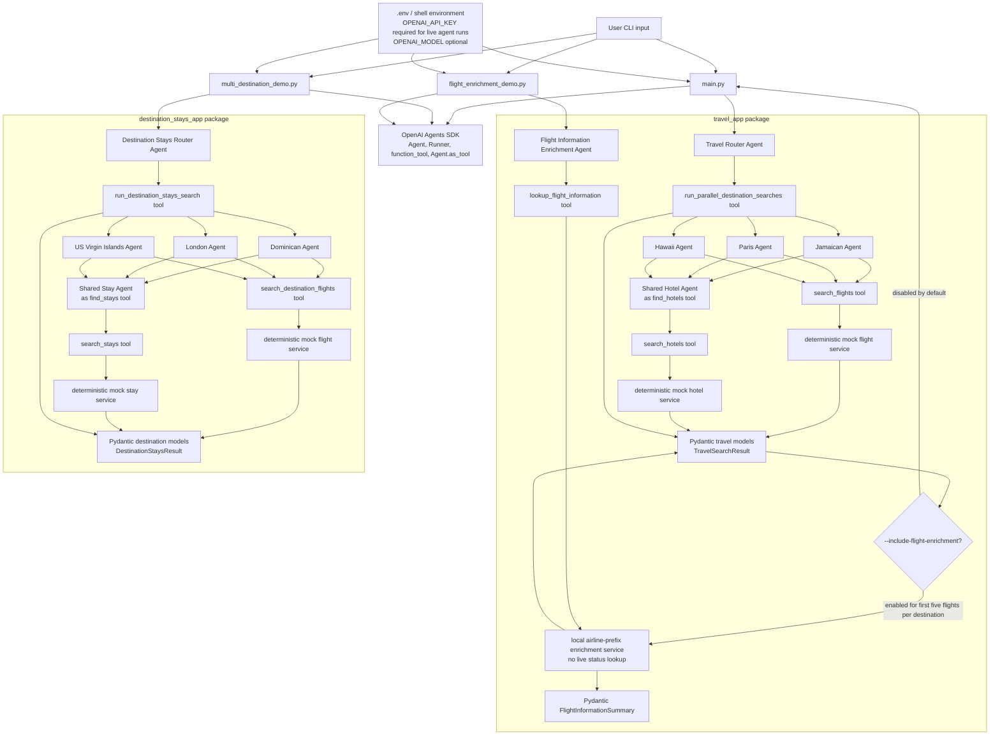

# Parallel Travel Agents Demo

This repository contains OpenAI Agents SDK examples for fan-out/fan-in travel
planning workflows plus a conservative flight information enrichment agent.

The examples use:

- `Agent`, `Runner`, and `@function_tool`
- shared specialist agents exposed with `Agent.as_tool(...)`
- guaranteed parallel execution with `asyncio.gather(...)`
- Pydantic structured outputs
- per-destination error isolation
- final data correlated by destination/place
- conservative flight-number enrichment without guessing live status

> The bundled flight, hotel, and stay services use deterministic **mock data**.
> They are not real-time schedules, fares, inventory, status, or availability.

## Examples

### Original Travel Demo

Entry point:

```bash
uv run python main.py
```

Package:

```text
travel_app/
```

Workflow:

- **Travel Router Agent**
- **Jamaican Agent**
- **Paris Agent**
- **Hawaii Agent**
- one reusable **Hotel Agent**
- final output: `TravelSearchResult`

Custom request:

```bash
uv run python main.py \
  "Find flights and hotels between October 10, 2026 and October 17, 2026."
```

Optional flight enrichment for the top five flights per destination:

```bash
uv run python main.py --include-flight-enrichment \
  "Find flights and hotels between October 10, 2026 and October 17, 2026."
```

The `--include-flight-enrichment` flag attaches conservative local
`FlightInformationSummary` metadata to the first five flights returned for each
destination. The original mock flight schedule, route, price, and hotel data are
preserved. Because there is no live flight provider integration, real-time status remains unverified.

Single-file learning version:

```bash
uv run python single_file_demo.py
```

### Destination Stays Demo

Entry point:

```bash
uv run python multi_destination_demo.py
```

Package:

```text
destination_stays_app/
```

Workflow:

- **Destination Stays Router Agent**
- **Dominican Agent**
- **London Agent**
- **US Virgin Islands Agent**
- one reusable **Stay Agent**
- final output: `DestinationStaysResult`

Custom request:

```bash
uv run python multi_destination_demo.py \
  "Find flights and stays between October 10, 2026 and October 17, 2026."
```

### Flight Enrichment Demo

Entry point:

```bash
uv run python flight_enrichment_demo.py
```

Package:

```text
travel_app/
```

Workflow:

- **Flight Information Enrichment Agent**
- `lookup_flight_information` tool
- final output: `FlightInformationSummary`

Custom request:

```bash
uv run python flight_enrichment_demo.py \
  "Enrich flight AA1234 for October 10, 2026."
```

The enrichment demo currently uses a conservative local tool. It can identify
common airline prefixes and marks route, schedule, gate, terminal, aircraft,
delay, cancellation, and real-time status fields as unverified until a reliable
live flight provider or web lookup tool is added.

## Setup

```bash
cp .env.example .env
# Edit .env and provide OPENAI_API_KEY.

uv sync
```

Optional model override:

```bash
OPENAI_MODEL=<model-name-you-have-access-to>
```

## Tests

The unit tests are offline and do not require `OPENAI_API_KEY`. They cover mock
services, Pydantic serialization, tool error mapping, orchestration correlation,
per-destination error isolation, flight enrichment stubs, and SDK import safety.

Run them with:

```bash
uv run pytest
```

## Architecture

User input enters through one of the CLI entry points. Each CLI calls
`Runner.run(...)` with the relevant router or enrichment agent and then validates
the final response with `final_output_as(...)`.

The two destination-planning demos use manager-style orchestration. The router
agent extracts dates and calls one orchestration tool. That tool owns the
fan-out/fan-in behavior and runs destination agents concurrently with
`asyncio.gather(...)`. The shared Hotel Agent and Stay Agent are reused through
`Agent.as_tool(...)`.

The original travel flow also supports optional post-search flight enrichment.
When `main.py` is run with `--include-flight-enrichment`, it enriches the first
five flights per destination after fan-in. Enrichment failures are attached to
the flight metadata and do not fail the destination result.

The flight enrichment demo is a single-agent workflow. Its tool is a conservative
local lookup that identifies common airline prefixes and reports live flight
fields as unverified. It does not call a live flight data provider or web search.



### Agent contracts

| Agent | Package | Role | Tools | Expected input | Structured output |
| --- | --- | --- | --- | --- | --- |
| Travel Router Agent | `travel_app` | Extracts an inclusive date range and starts the original Jamaica/Paris/Hawaii search. | `run_parallel_destination_searches` | Natural-language request with dates. | `TravelSearchResult` |
| Jamaican Agent | `travel_app` | Gets 10 BWI flights to Jamaica and 5 hotels. | `search_flights`, shared `find_hotels` | Destination context plus ISO start/end dates. | `DestinationResult` |
| Paris Agent | `travel_app` | Gets 10 BWI flights to Paris and 5 hotels. | `search_flights`, shared `find_hotels` | Destination context plus ISO start/end dates. | `DestinationResult` |
| Hawaii Agent | `travel_app` | Gets 10 BWI flights to Hawaii and 5 hotels. | `search_flights`, shared `find_hotels` | Destination context plus ISO start/end dates. | `DestinationResult` |
| Hotel Agent | `travel_app` | Shared hotel specialist reused by destination agents. | `search_hotels` | Destination plus check-in/check-out dates. | `HotelSearchResponse` |
| Optional original-flow enrichment | `travel_app` | Adds `FlightInformationSummary` to the top five flights per destination when `main.py --include-flight-enrichment` is used. | local `enrich_flight_information_service` after fan-in | Existing `TravelSearchResult` with mock flights. | `TravelSearchResult` with optional `Flight.enrichment` fields |
| Destination Stays Router Agent | `destination_stays_app` | Extracts an inclusive date range and starts the Dominican/London/USVI search. | `run_destination_stays_search` | Natural-language request with dates. | `DestinationStaysResult` |
| Dominican Agent | `destination_stays_app` | Gets 10 BWI flights to the Dominican Republic and 5 stays. | `search_destination_flights`, shared `find_stays` | Destination context plus ISO start/end dates. | `PlaceResult` |
| London Agent | `destination_stays_app` | Gets 10 BWI flights to London and 5 stays. | `search_destination_flights`, shared `find_stays` | Destination context plus ISO start/end dates. | `PlaceResult` |
| US Virgin Islands Agent | `destination_stays_app` | Gets 10 BWI flights to the US Virgin Islands and 5 stays. | `search_destination_flights`, shared `find_stays` | Destination context plus ISO start/end dates. | `PlaceResult` |
| Stay Agent | `destination_stays_app` | Shared stay specialist reused by destination agents. | `search_stays` | Destination plus check-in/check-out dates. | `StaySearchResponse` |
| Flight Information Enrichment Agent | `travel_app` | Enriches a flight number without guessing live status. | `lookup_flight_information` | Natural-language flight-number request, ideally with date. | `FlightInformationSummary` |

### Handoffs

These examples do not use SDK handoffs. A handoff transfers control to one
specialist, while the destination workflows need all destination agents to run
and return correlated results. The shared Hotel Agent and Stay Agent are exposed
as tools with `Agent.as_tool(...)` instead.

### External services

There are no live travel-provider integrations in the current codebase. Flight,
hotel, and stay providers are deterministic local services under `services/`.
The flight enrichment service is also local and explicitly marks real-time
schedule/status fields as unverified.

The optional original-flow enrichment and the standalone flight enrichment demo
share the same local enrichment service. Both preserve
`real_time_status_verified=False` until a real provider or reliable web lookup
is added.

## Why packages avoid top-level `agents/`

The OpenAI Agents SDK itself is imported as:

```python
from agents import Agent, Runner, function_tool
```

A top-level local directory named `agents/` would shadow that installed package.
Therefore application agents live inside example-specific packages:

```text
travel_app/agents/
destination_stays_app/agents/
```

That avoids an import collision while still keeping the agent definitions grouped
cleanly.

## Project layout

```text
travel_agents/
├── AGENTS.md
├── README.md
├── main.py
├── flight_enrichment_demo.py
├── multi_destination_demo.py
├── single_file_demo.py
├── pyproject.toml
├── .env.example
├── tests/
│   ├── test_agent_imports.py
│   ├── test_models.py
│   ├── test_orchestration.py
│   ├── test_readme.py
│   ├── test_services.py
│   └── test_tools.py
├── .codex/
│   └── skills/
│       └── python-openai-agents/
│           └── SKILL.md
├── destination_stays_app/
│   ├── agents/
│   │   ├── common.py
│   │   ├── router_agent.py
│   │   ├── dominican_agent.py
│   │   ├── london_agent.py
│   │   ├── us_virgin_islands_agent.py
│   │   └── stay_agent.py
│   ├── models/
│   │   └── destination_models.py
│   ├── orchestration/
│   │   └── destination_orchestrator.py
│   ├── services/
│   │   ├── flight_service.py
│   │   └── stay_service.py
│   └── tools/
│       ├── flight_tools.py
│       └── stay_tools.py
└── travel_app/
    ├── agents/
    │   ├── common.py
    │   ├── flight_enrichment_agent.py
    │   ├── router_agent.py
    │   ├── jamaican_agent.py
    │   ├── paris_agent.py
    │   ├── hawaii_agent.py
    │   └── hotel_agent.py
    ├── models/
    │   ├── flight_enrichment_models.py
    │   └── travel_models.py
    ├── orchestration/
    │   └── travel_orchestrator.py
    ├── services/
    │   ├── flight_enrichment_service.py
    │   ├── flight_service.py
    │   └── hotel_service.py
    └── tools/
        ├── flight_enrichment_tools.py
        ├── flight_tools.py
        └── hotel_tools.py
```

Key implementation files:

| Area | File |
| --- | --- |
| Original router agent | `travel_app/agents/router_agent.py` |
| Original orchestration tool | `travel_app/orchestration/travel_orchestrator.py` |
| Flight enrichment agent | `travel_app/agents/flight_enrichment_agent.py` |
| Flight enrichment tool | `travel_app/tools/flight_enrichment_tools.py` |
| Destination stays router agent | `destination_stays_app/agents/router_agent.py` |
| Destination stays orchestration tool | `destination_stays_app/orchestration/destination_orchestrator.py` |
| README consistency tests | `tests/test_readme.py` |

## Replace mock providers

For flights, keep this service shape and replace only the implementation:

```python
async def search_flights_service(
    *,
    origin: str,
    destination_airports: list[str],
    start_date: date,
    end_date: date,
    limit: int = 10,
) -> list[Flight]:
    ...
```

For hotels or stays, keep these shapes:

```python
async def search_hotels_service(
    *,
    destination: str,
    check_in: date,
    check_out: date,
    limit: int = 5,
) -> list[Hotel]:
    ...
```

```python
async def search_stays_service(
    *,
    destination: str,
    check_in: date,
    check_out: date,
    limit: int = 5,
) -> list[Stay]:
    ...
```

Then map provider responses into the relevant Pydantic models.

## Error isolation

Each orchestration layer catches an exception from an entire destination Agent
run and converts it into that destination's `agent_error`. The other destination
runs continue.

Flight and hotel/stay tool results also have separate error fields, so one tool
failure does not erase successful data from the same destination.

The flight enrichment tool returns a structured summary even when it cannot
verify live flight data. Unverified fields are listed explicitly instead of being
guessed.

Optional enrichment in the original travel flow follows the same rule. If
enrichment fails for a flight, the original flight and destination data remain in
the response and the enrichment error is recorded in that flight's enrichment
notes.

## Production additions

For real travel data, add:

- authorized flight/hotel provider APIs
- provider offer IDs and expiry timestamps
- API timeouts and retry/backoff
- rate limiting
- structured logging and tracing
- cache policy for time-sensitive availability
- secrets management
- provider-specific error mapping
